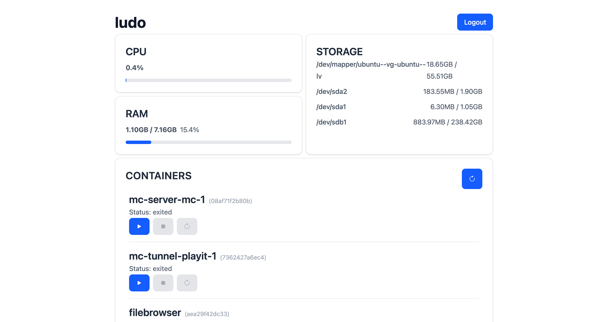

# Simple Linux Dashboard
I needed a lightweight web dashboard for my Ubuntu server so I could manager my Docker containers, as well as monitor CPU, RAM, and storage usage. Other options were too resource intensive or too bloated, so I built this.



## Features
Monitor CPU / RAM / Storage with [psutil](https://psutil.readthedocs.io/stable/).  
Manager Docker containers with [Docker SDK for Python](https://docker-py.readthedocs.io/en/stable/).  
Protect dashboard with built-in user authentication.

## Tech
FastAPI back end, React + Tailwindcss front end.

## Set Up
### Requirments
All Python requirements can be found in [requirements.txt](requirements.txt).

### Add a user
All users are stored in a file called `users.json`. The file `example.users.json` shows the required format and can simply be renamed to `users.json` and edited with your credentials. The password **must** be stored as a `bcrpyt` hash. A site like [this](https://bcrypt-generator.com/) can help hash your password.

### Environment variables
Only one environment variable is used in this dashboard. Session cookies are configured to not be secure by default. If you are serving the dashboard over `https` and would like to use secure cookies, rename `example.env` to `.env` and update `SECURE_COOKIES=false` to `SECURE_COOKIES=true`.

## Starting the server
On my machine, I use a bash script to activate the virtual environment, start the server, store logs in a file, and store the PID in another. 
``` bash
  source .venv/bin/activate
  fastapi run main.py  > server.log 2>&1 &
  echo $! > server.pid
```

By default, the server runs on port 8000. To specify a port, use the `--port` flag on the `fastapi` command.
``` bash
  # Run server on port 3000
  source .venv/bin/activate
  fastapi run --port 3000 main.py > server.log 2>&1 &
  echo $! > server.pid
```

I also use a bash script to stop the server.
```
  kill $(cat server.pid)
```

## Security
This dashboard was developed to be used **only on your local or virtual private network**. It is not recommended to make your dashboard publicly available over the internet, as this may make the dashboard more vulnerable to malicious actors. 
